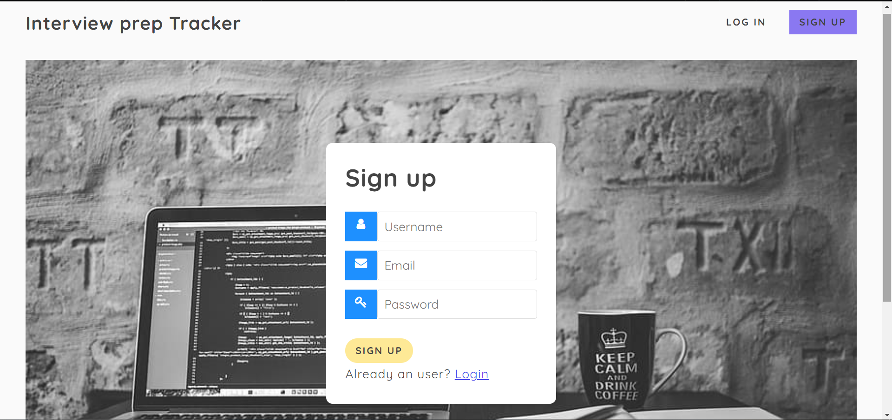
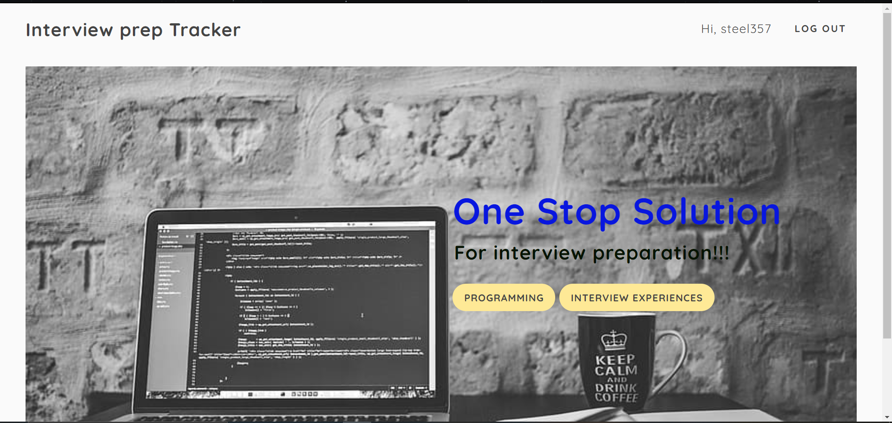
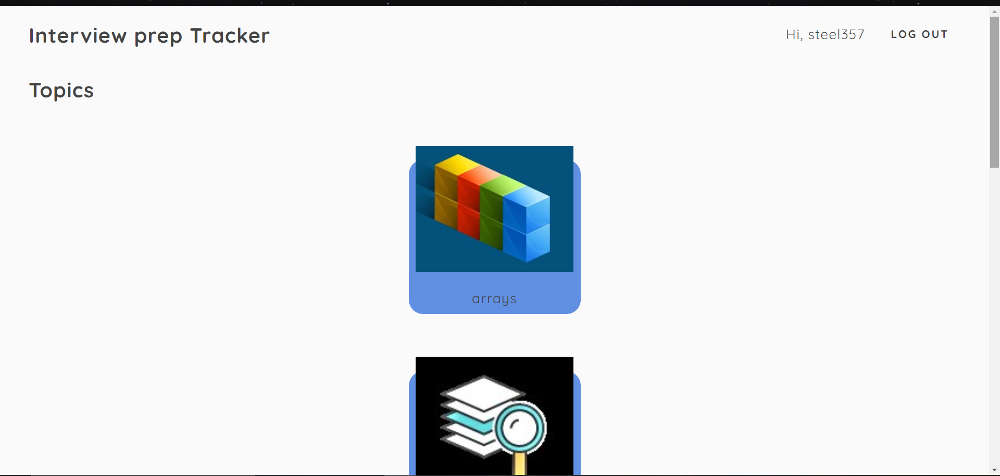
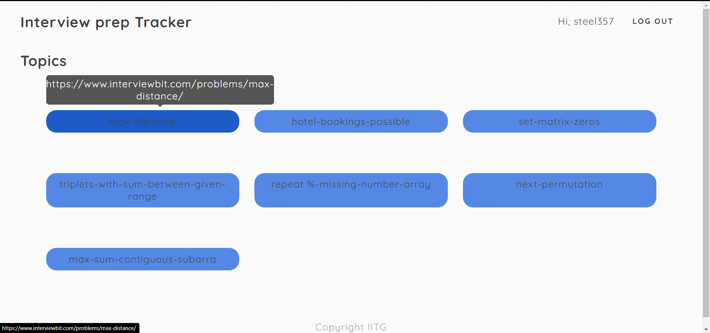
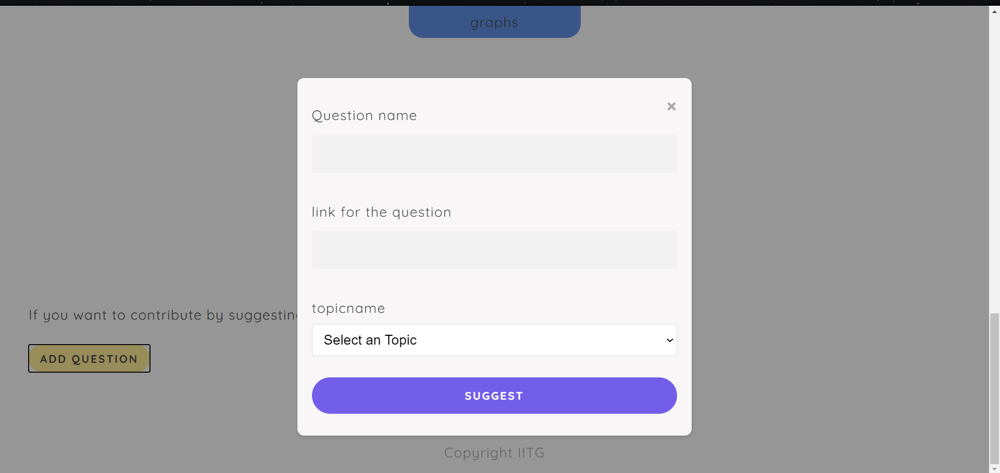
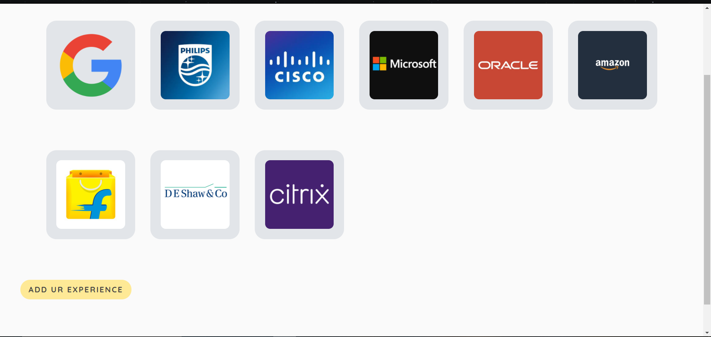
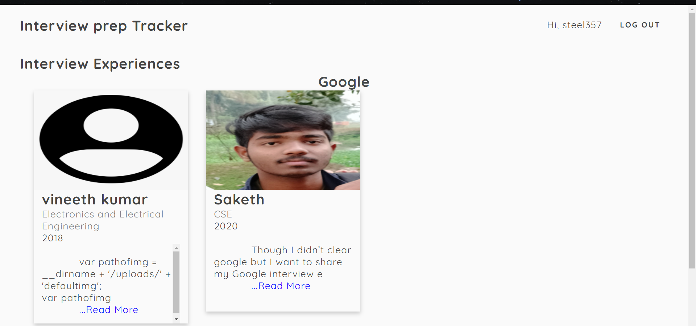
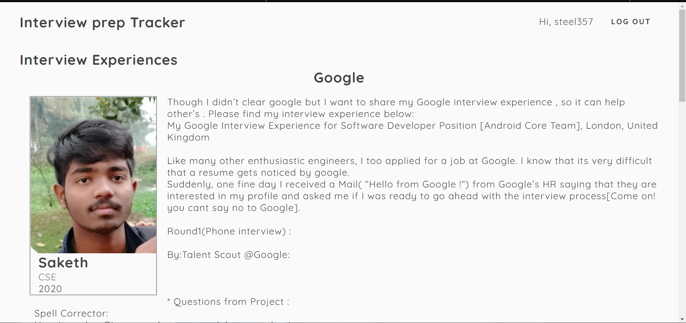
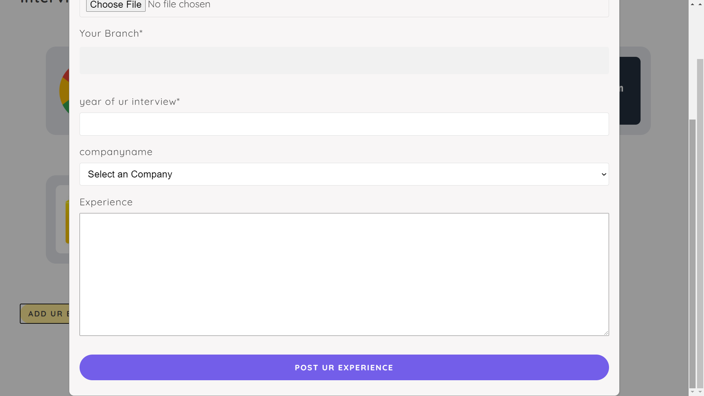

# Interview-Prep-Tracker

This is an web application which helps for the preparation of interviews by providing previous years experiences of others and also by providing good programming questions to practice. 

### Used Tech
* Node.js
* MongoDB
* HTML 
* CSS
* JavaScript

### Home Page

This is an home page before user logged in. User has to login first to use the features of the website

This is the signup page. User can create an account at first once and afterwards user can login directly.

This is the home page after user logins. Now user can use programming and interview experiences features.

### Programming page

User can select any topics to pratice and he can also contrebute new question by "Add Question" option at the end of the page.

Thi is the page showing all question of arrays topic. 

